# Jarkom-Modul-4-D01-2021
Kelompok D01:
1. Zelda Elma Sibuea / 05111940000038
2. Rosa Amalia / 05111940000106
3. Raharja Dui Putra Sutedjo / 05111940000222

# Soal
Lakukan pembagian subnet dengan teknik VLSM dan CIDR


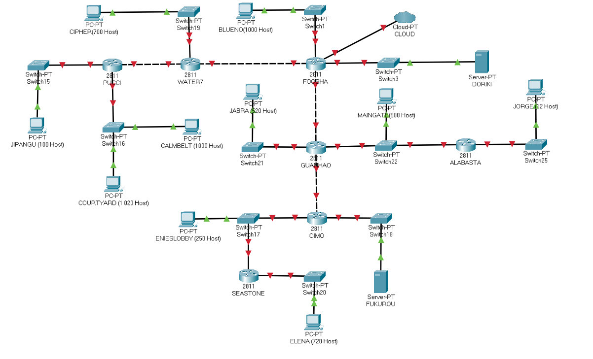

# Jawaban
## VLSM
Pengerjaan dengan teknik VLSM dilakukan di CPT (Cisco Packet Tracer)
Dalam pengerjaan dengan menggunakan metode VLSM, kami membagi gambar tersebut kedalam beberapa bagian kecil. Berikut adalah gambar pembagian yang telah kami buat.


Setelah melakukan pembagian tersebut, berikut nya kami menghitung berapa jumlah host pada setiap subnet dan netmask berapa yang akan digunakan. 
Berikut adalah perhitungannya

|Label  | Jumlah | Netmask |
|-------|--------|---------|
| A1    | 701    |/22      |
| A2    | 1001   |/22      |
| A3    | 101    |/25      |
| A4    | 2      |/30      |
| A5    | 2      |/30      |
| A6    | 2      |/30      |
| A7    | 13     |/28      |
| A8    | 502    |/23      |
| A9    | 2      |/30      |
| A10   | 521    |/22      |
| A11   | 2021   |/21      |
| A12   | 252    |/24      |
| A13   | 2      |/30      |
| A14   | 2      |/30      |
| A15   | 721    |/22      |
|Jumlah | 5845   |/19      |


Pada major networknya berada pada netmask /19. Dan prefix IP kelompok kami adalah 192.192.X.X
Untuk melakukan perhitungan subnetting dengan metode VLSM, maka kami membuat pohon perhitungan VLSM
yaitu dapat dilihat sebagai berikut :


Untuk tabel perhitungannya adalah sebagai berikut :
|Nama Subnet  |  Address      |  Mask  |    Dec Mask   |    Assignable Range            | 
|-------------|---------------|--------|---------------|--------------------------------|
|    A1       | 192.192.16.0  |  /22   |255.255.252.0  | 192.192.16.1 - 192.192.19.254  |
|    A2       | 192.192.8.0   |  /22   |255.255.252.0  | 192.192.8.1 - 192.192.11.254   |
|    A3       | 192.192.27.0  |  /25   |255.255.252.128| 192.192.27.1 - 192.192.19.126  |
|    A4       | 192.192.27.144|  /30   |255.255.255.252| 192.192.27.145 - 192.192.27.146|
|    A5       | 192.192.27.148|  /30   |255.255.255.252| 192.192.27.149 - 192.192.27.150|
|    A6       | 192.192.27.152|  /30   |255.255.255.252| 192.192.27.153 - 192.192.27.154|
|    A7       | 192.192.27.128|  /28   |255.255.255.240| 192.192.27.129 - 192.192.27.142|
|    A8       | 192.192.24.0  |  /23   |255.255.254.0  | 192.192.24.1   - 192.192.25.254|
|    A9       | 192.192.27.156|  /30   |255.255.255.252| 192.192.27.157 - 192.192.27.158|
|    A10      | 192.192.20.0  |  /22   |255.255.252.0  | 192.192.20.1   - 192.192.23.254|
|    A11      | 192.192.0.0   |  /21   |255.255.248.0  | 192.192.0.1 - 192.192.7.254    |
|    A12      | 192.192.26.0  |  /24   |255.255.255.0  | 192.192.26.1   - 192.192.26.254|
|    A13      | 192.192.27.160|  /30   |255.255.255.252| 192.192.27.161 - 192.192.27.162|
|    A14      | 192.192.27.164|  /30   |255.255.255.252| 192.192.27.161 - 192.192.27.162|
|    A15      | 192.192.12.0  |  /22   |255.255.252.0  | 192.192.12.1 - 192.192.15.254  |


Untuk VLSM kami mengerjakan nya pada Cisco Packet Tracert. Pada CPT kami membuat topologi jaringan terlebih dahulu sebagai berikut


Dalam pengaturan IP, kami memngatur IP berdasarkan perhitungan yang telah kami buat. Contoh berikut ini, kita ambil subnet A2.
```
    Subnet A2 : 
    NID : 192.192.8.0
    Netmask : 255.255.252.0
    IP range : 192.192.8.1 - 192.192.11.254
```
Maka, berdasarkan data tersebut, pada cisco tracker kita akan mengaturnya.
Mulai pada Foosha dapat kita lihat bahwa interface yang terhubung dengan
subnet A2 adalah `Fa0/0` . Maka kita atur sebagai berikut berdasarkan
ip rangenya : <br>


Setelah mengatur IP pada Foosha, maka selanjutnya, kita mengatur
IP pada Blueno yang merupakan bagian dari subnet A2.Berdasarkan IP range
yang tersedia, sebagai berikut : <br>
 


Setelah semuanya berhasil, maka lakukan hal yang sama pada semua subnet


### Routing pada VLSM
###Routing pada VLSM

Setelah semua sudah diatur IPnya,maka selanjutnya melakukan routing
agar semua dapat terhubung. Kami mengambil contoh `Router Water7`.
 - Water 7 harus terhubung dengan subnet A3
 - Water 7 harus terhubung dengan subnet A11
 - Subnet A3 dan A11 terhubung ke `Pucci`
Oleh karena itu pengaturan routingnya adalah sebagai berikut :
```
Subnet A3 :
    NID = 192.217.27.0
    Netmask = 255.255.255.128
    NextHop  = 192.192.27.146

Subnet A11 :
    NID = 192.217.0.0
    Netmask = 255.255.248.0
    NextHop  = 192.192.27.146

Dan kerena water7 berada di bawah Foosha, maka kita perlu menabmahkan routing
    NID : 0.0.0.0
    Netmask : 0.0.0.0
    Nexthop : 192.192.27.149
```
Berikut ini contoh routing pada `water7`


Lalu, berikut ini merupakan routing pada setiap router yang ada :
- Pucci
```
0.0.0.0/0 via 192.192.27.144
```
- Water7
```
192.192.27.0/25 via 192.192.27.154
192.192.0.0/21 via 192.192.27.154
0.0.0.0/0 via 192.192.27.150
```
- Foosha
```
192.192.16.0/22 via 192.192.27.149
192.192.27.0/25 via 192.192.27.149
192.192.0.0/21 via 192.192.27.149
192.192.27.144/30 via 192.192.27.149
192.192.12.0/22 via 192.192.27.158
192.192.26.0/24 via 192.192.27.158
192.192.27.160/30 via 192.192.27.158
192.192.27.164/30 via 192.192.27.158
192.192.20.0/22 via 192.192.27.158
192.192.27.128/28 via 192.192.27.158
192.192.24.0/23 via 192.192.27.158
```
- Guanhao
```
0.0.0.0/0 via 192.192.27.157
192.192.12.0/22 via 192.192.27.162
192.192.26.0/24 via 192.192.27.162
192.192.27.164/30 via 192.192.27.162
192.192.27.128/28 via 192.192.24.3
```
- Alabasta
```
0.0.0.0/0 via 192.192.24.1
```
- Oimo
```
0.0.0.0/0 via 192.192.27.161
192.192.12.0/22 via 192.192.26.3
```
- Seastone
```
0.0.0.0/0 via 192.192.26.1
```
 
## CIDR
Pengerjaan dengan teknik CIDR dilakukan di GNS3

Melakukan penggabungan subnet-subnet dari yang terkecil hingga menjadi satu subnet besar. Berikut merupakan langkah-langkah penggabungan subnet serta pelabelannya.


Hasil penggabungan subnet yang telah didapatkan dibuat dalam bentuk tree sebagai berikut.


Dari tree yang telah dibuat, didapatkan pembagian NID untuk setiap subnet kecil sebagai berikut. <br>


Kemudian, melakukan konfigurasi subnet pada topologi yang telah dibuat di GNS3. Konfigurasi yang dilakukan adalah sebagai berikut. <br>

### IP Alabasta
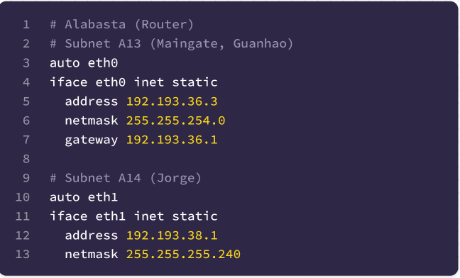

### IP Blueno
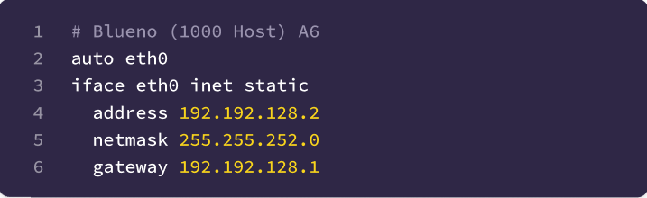

### IP Calmbelt
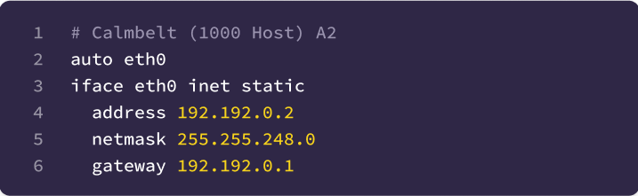

### IP Chiper
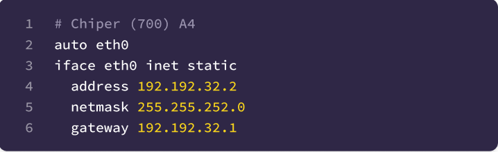

### IP Courtyard
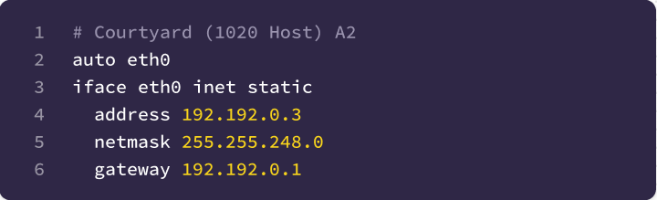

### IP Doriki
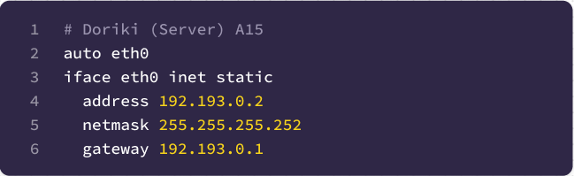

### IP Elena
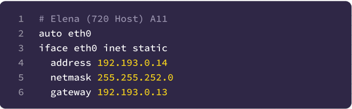

### IP EniesLobby
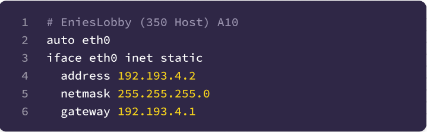

### IP Foosha
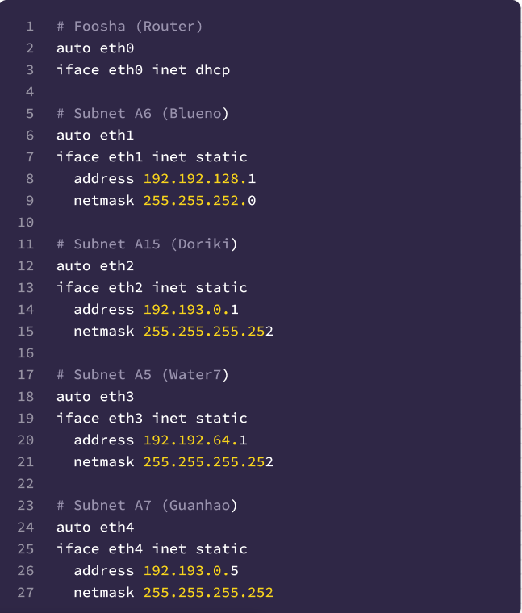

### IP Fukurou
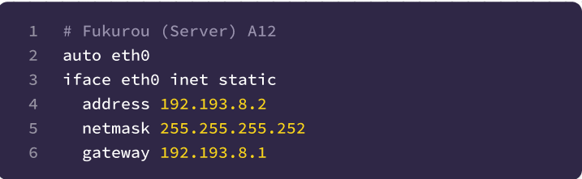

### IP Guanhao
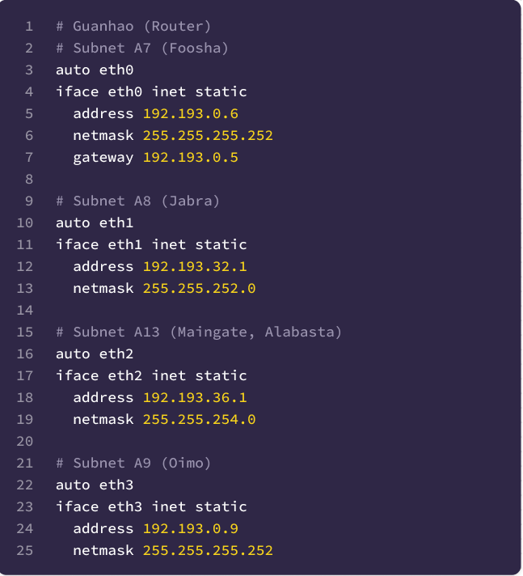

### IP Jabra
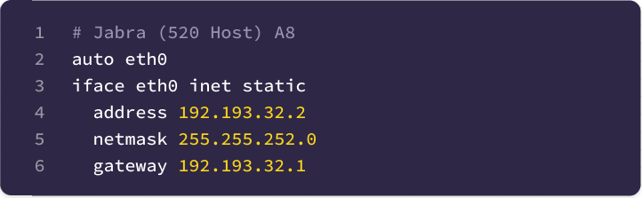

### IP Jipangu
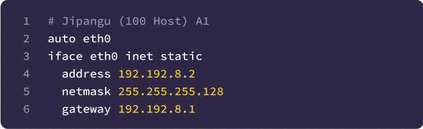

### IP Jorge
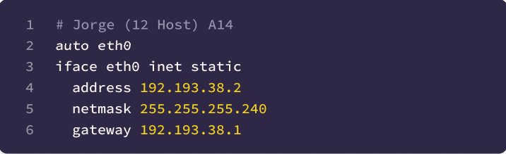

### IP Maingate
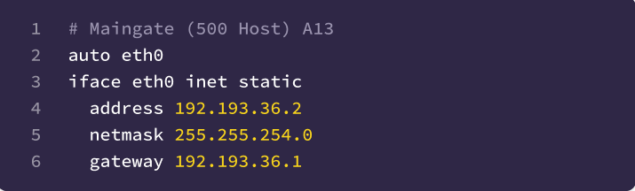

### IP Oimo
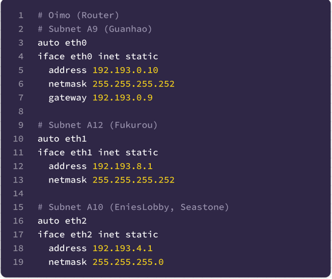

### IP Pucci
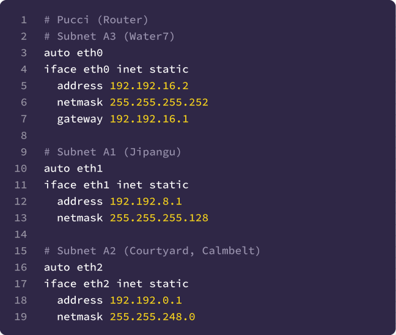

### IP Seastone
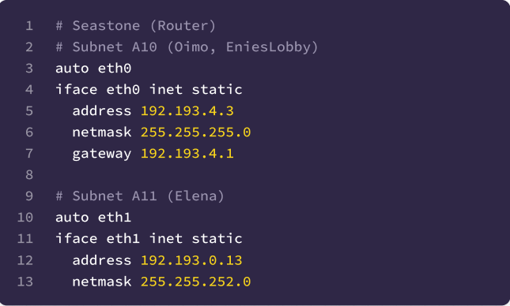

### IP Water7
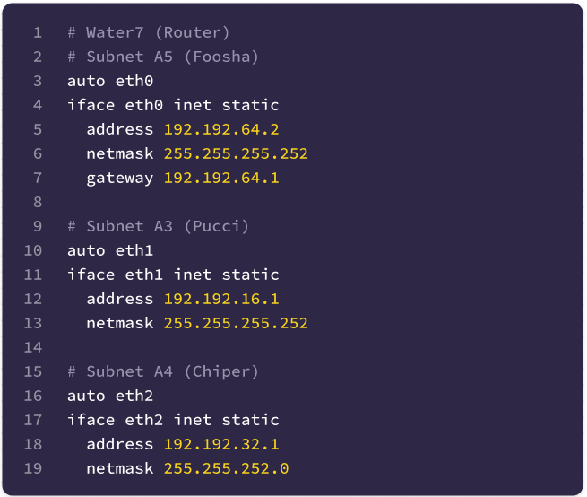


Berikut merupakan konfigurasi routing pada setiap router untuk menghubungan client dan server.


### Alabasta
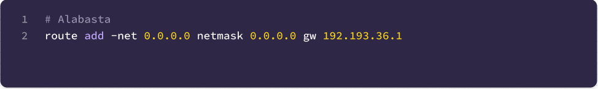

### Foosha
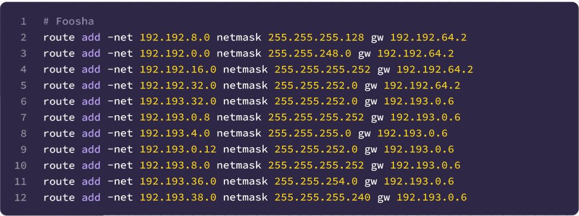

### Guanhao
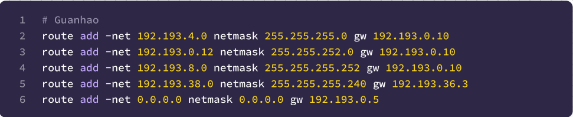

### Oimo
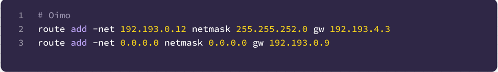

### Pucci
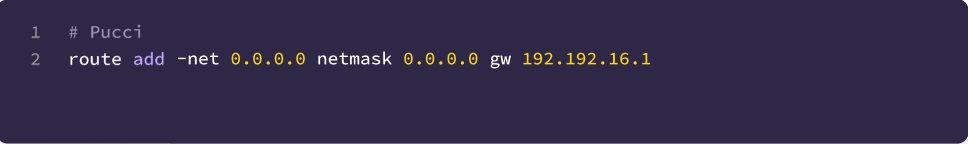

### Seastone
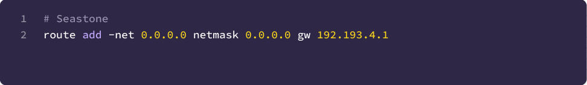

### Water7
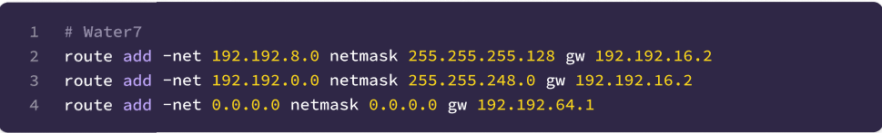
