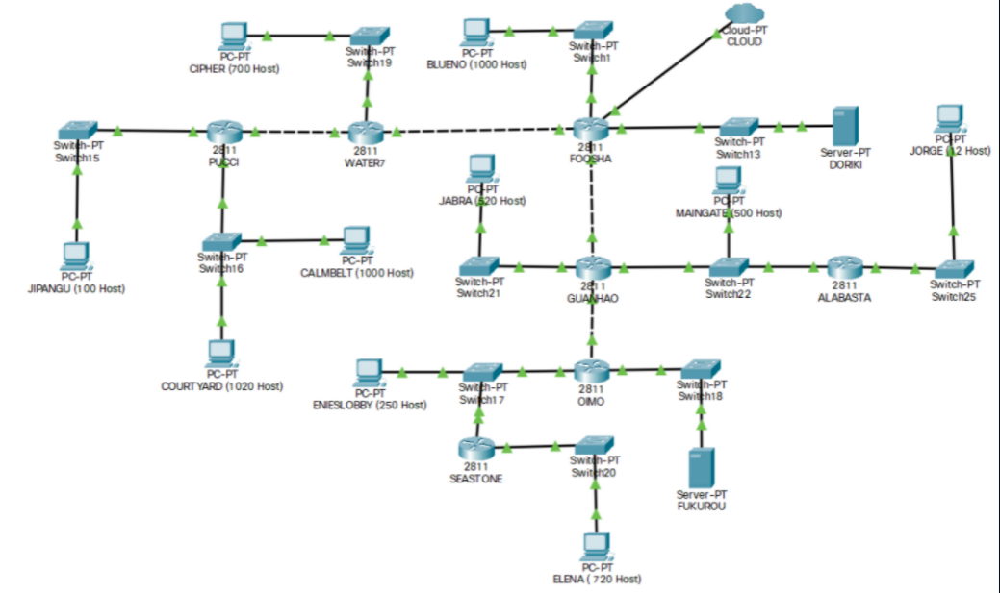

# Jarkom-Modul-4-D01-2021
Kelompok D01:
1. Zelda Elma Sibuea / 05111940000038
2. Rosa Amalia / 05111940000106
3. Raharja Dui Putra Sutedjo / 05111940000222

# Soal
Lakukan pembagian subnet dengan teknik VLSM dan CIDR

# Jawaban
## VLSM
Pengerjaan dengan teknik VLSM dilakukan di CPT (Cisco Packet Tracer)
Dalam pengerjaan dengan menggunakan metode VLSM, kami membagi gambar tersebut kedalam beberapa bagian kecil. Berikut adalah gambar pembagian yang telah kami buat.

Setelah melakukan pembagian tersebut, berikut nya kami menghitung berapa jumlah host pada setiap subnet dan netmask berapa yang akan digunakan. 
Berikut adalah perhitungannya

|Label  | Jumlah | Netmask |
|-------|--------|---------|
| A1    | 701    |/22      |
| A2    | 1001   |/22      |
| A3    | 101    |/25      |
| A4    | 2      |/30      |
| A5    | 2      |/30      |
| A6    | 2      |/30      |
| A7    | 13     |/28      |
| A8    | 502    |/23      |
| A9    | 2      |/30      |
| A10   | 521    |/22      |
| A11   | 2021   |/21      |
| A12   | 252    |/24      |
| A13   | 2      |/30      |
| A14   | 2      |/30      |
| A15   | 721    |/22      |
|Jumlah | 5845   |/19      |

 
## CIDR
Pengerjaan dengan teknik CIDR dilakukan di GNS3

Melakukan penggabungan subnet-subnet dari yang terkecil hingga menjadi satu subnet besar. Berikut merupakan langkah-langkah penggabungan subnet serta pelabelannya.

Hasil penggabungan subnet yang telah didapatkan dibuat dalam bentuk tree sebagai berikut.

Dari tree yang telah dibuat, didapatkan pembagian NID untuk setiap subnet kecil sebagai berikut.  

Kemudian, melakukan konfigurasi subnet pada topologi yang telah dibuat di GNS3. Konfigurasi yang dilakukan adalah sebagai berikut.  

### IP Alabasta

### IP Blueno

### IP Calmbelt

### IP Chiper

### IP Courtyard

### IP Doriki

### IP Elena

### IP EniesLobby

### IP Foosha

### IP Fukurou

### IP Guanhao

### IP Jabra

### IP Jipangu

### IP Jorge

### IP Maingate

### IP Oimo

### IP Pucci

### IP Seastone

### IP Water7

Berikut merupakan konfigurasi routing pada setiap router untuk menghubungan client dan server.

### Alabasta

### Foosha

### Guanhao

### Oimo

### Pucci

### Seastone

### Water7

